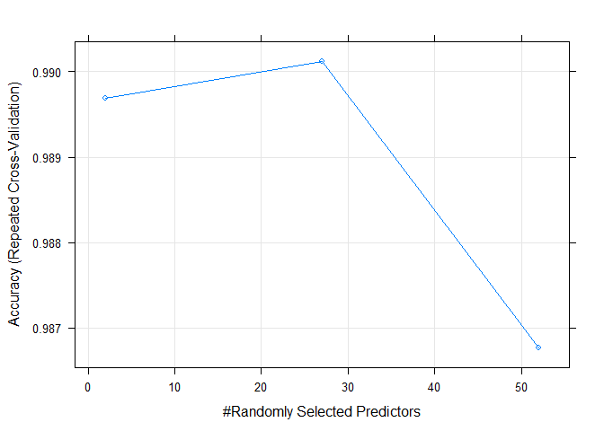
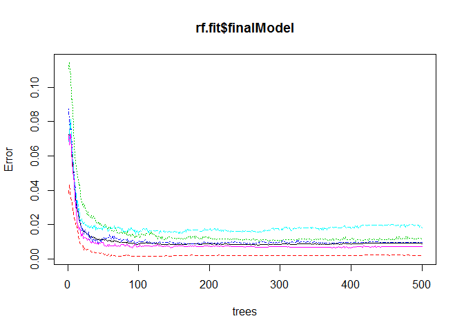
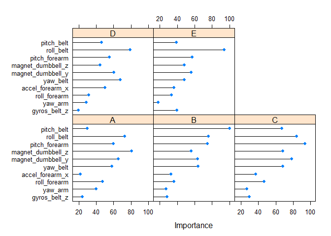

# Practical Machine Learning - Prediction Assignment
Piolivie  
Sunday, June 05, 2016  

# Summary

The goal of the assignment is to predict how well participants perform barbell lifts correctly and incorrectly using data from accelerometers on the belt, forearm, arm, and dumbell of 6 participants. 
More information is available from the website http://groupware.les.inf.puc-rio.br/har.
We trained a model using "Random Forest" algo with 5 times repeated 10-fold cross validation.
The Out of sample accuracy of the model is on average 0.9926 and lies with a probability of 95% between (0.9905, 0.9944). 

# Stage setting 


```r
# Set work directory
setwd("D:/Users/piolivie/Documents/Coursera/Data Science Specialization/8 - Practical Machine Learning/Prediction Assignment")

# Load libraries
library(caret)
library(randomForest)

# Load data
pml_training <- read.csv("pml-training.csv",na.strings=c("NA","#DIV/0!",""))
pml_testing <- read.csv("pml-testing.csv",na.strings=c("NA","#DIV/0!",""))      
```

# Preprocessing


```r
setwd("D:/Users/piolivie/Documents/Coursera/Data Science Specialization/8 - Practical Machine Learning/Prediction Assignment")

# Separate outcome and predictors
predictors<-pml_training[, 1:159]
outcome<-data.frame(classe=pml_training[, 160])
summary(outcome$classe) # outcome classe is balanced.
```

```
##    A    B    C    D    E 
## 5580 3797 3422 3216 3607
```

```r
# Remove unrelevant variables as they are unlikely to be related to outcome.
remove = c('X', 'user_name', 'raw_timestamp_part_1', 'raw_timestamp_part_2', 'cvtd_timestamp', 'new_window', 'num_window')
predictors <- predictors[, -which(names(predictors) %in% remove)]

# Remove Zero- and Near Zero-Variance Predictors
# Zero-variance predictors may cause the model to crash or the fit to be unstable. 
# Near-zero variance predictors may become zero-variance predictors when the data are split into 
# cross-validation. Therefore, these predictors are eliminated prior to modeling. 
nzv <- nearZeroVar(predictors)
predictors <- predictors[, -nzv]

# Remove variables that have too many NA values.
predictors.na<-predictors[,colSums(is.na(predictors))>0]
min(100*colSums(is.na(predictors.na))/dim(predictors.na)[1])
```

```
## [1] 97.93089
```

```r
# About 98% of the values of predictors with missing values are NA, 
# Eliminate these prior to modeling, because they probably don't have a big impact on classe. 
predictors <- predictors[ , colSums(is.na(predictors)) == 0]

# Rebuild cleaned training dataset
pml_training<-cbind(predictors,outcome)
```

# Modeling

## Approach

### 1. Split dataset in training and test set
Recommended split for medium sample sizes: 60% training, 40% test, no validation set  (Practical Machine Learning Course Notes, 2015, p7). Training set is used to estimate model parameters and to pick the values of the complexity parameter(s) for the model. Test set can be used to get an independent assessment of model accurcacy. They should not be used during model training.

### 2. Train model using "Random Forest" algo with 5 times repeated 10-fold cv
Random forests work quite well in lots of different situations, so they are often tried first (Stanton, 2015). We will use 5 repeats of 10-fold cross-validation for model performance evalution, because K-fold cv is a robust method for estimating accuracy (Brownlee, 2014).
K=10, because 10 is usually taken for medium data sets (Kuhn, useR! 2013,p20), but you can 
tune the amount of estimate bias, with popular values set to 3, 5, 7 and 10 (Brownlee, 2014).
Repeated K-fold cv is preferred over K-fold cv (Kuhn, useR! 2013,p20).

### 3. Predict test outcome and derive confusion matrix
Applying final trained model on test set and derive confusion matrix to have unbiased measurement of out of sample accuracy of model (and consequently expected out of sample error)  

## Execution

### 1. Split dataset in training and test set

```r
setwd("D:/Users/piolivie/Documents/Coursera/Data Science Specialization/8 - Practical Machine Learning/Prediction Assignment")
set.seed(12345)
inTrain <- createDataPartition(y=pml_training$classe, p = 0.60, list=FALSE)
training <- pml_training[inTrain,]
testing <- pml_training[-inTrain,]
```

### 2. Train model using "Random Forest" algo with 5 times repeated 10-fold cv

#### Fit Process
10-fold cross-validation means that we randomly split training data into 10 equally sized
pieces called "folds". Then, we train the model on 90% of the data, and check its accuracy on 10% of the data we left out. At the end, we average the percentage accuracy across the 10 different splits of the data to get an average accuracy. Model with highest average accuracy is selected.  
Repeated K-fold CV creates multiple versions of the folds and aggregates the results. 5 repeated 10-fold CV means that the splitting the data into 10 folds is repeated 5 times. The final model accuracy is taken as the mean from the number of repeats.

```r
rf.fit <- train(classe ~ ., 
               data = training, 
               method = "rf",     # Use the "random forest" algorithm
               importance = TRUE, # importance=TRUE allows to inspect variable importance
               trControl = trainControl(method = "repeatedcv", # Use cross-validation
                                        number = 10, # Use 10 folds for cross-validation
                                        repeats = 5)
               )
# save(rf.fit,file="rf.fit.RData")
```

```
## Random Forest 
## 
## 11776 samples
##    52 predictor
##     5 classes: 'A', 'B', 'C', 'D', 'E' 
## 
## No pre-processing
## Resampling: Cross-Validated (10 fold, repeated 5 times) 
## Summary of sample sizes: 10598, 10599, 10600, 10599, 10598, 10599, ... 
## Resampling results across tuning parameters:
## 
##   mtry  Accuracy   Kappa    
##    2    0.9896911  0.9869584
##   27    0.9901156  0.9874963
##   52    0.9867697  0.9832634
## 
## Accuracy was used to select the optimal model using  the largest value.
## The final value used for the model was mtry = 27.
```

The final value used for the model was mtry = 27. mtry is a hyperparameter of the random forest 
model that determines how many variables the model uses to split the trees. The table shows different values of mtry along with their corresponding average accuracies (and a couple other metrics) under cross-validation. 
Caret automatically picks the value of the hyperparameter "mtry" that was the most accurate under cross validation. This approach is called using a "tuning grid" or a "grid search."
As you can see, with mtry = 27, the average "in sample" accuracy was 0.9901156, or about 99 percent.

#### Final model

```r
rf.fit$finalModel
```

```
## 
## Call:
##  randomForest(x = x, y = y, mtry = param$mtry, importance = TRUE) 
##                Type of random forest: classification
##                      Number of trees: 500
## No. of variables tried at each split: 27
## 
##         OOB estimate of  error rate: 0.89%
## Confusion matrix:
##      A    B    C    D    E class.error
## A 3341    4    1    0    2 0.002090800
## B   18 2252    9    0    0 0.011847301
## C    0    9 2034   11    0 0.009737098
## D    0    1   30 1895    4 0.018134715
## E    0    2    5    9 2149 0.007390300
```

The accuracy of the random forest model is about 99%. OOB estimate of  error rate: 0.89%. 

#### Cross validation graph

```r
plot(rf.fit)
```

<!-- -->

The cross validation graph shows that the model with 27 predictors is selected by the best accuracy.

#### Final model plot

```r
plot(rf.fit$finalModel)
```

<!-- -->

The final model plot tells that the overall error converge at around 100 trees, so it is possible to speed up our algo by tuning the number of trees. 

####  Top ten important variables

```r
plot(varImp(rf.fit), top = 10)
```

<!-- -->

A list of top ten important variables in the model is also given regarding each class of activity.

### 3. Predict test outcome and derive confusion matrix

Predict test outcome applying final trained random forest model on the test set and derive confusion matrix to have unbiased measurement of 'out of sample' accuracy of model (and consequently expected out of sample error).  


```r
rf.predict<-predict(rf.fit , testing)
confusionMatrix(rf.predict, testing$classe)
```

```
## Confusion Matrix and Statistics
## 
##           Reference
## Prediction    A    B    C    D    E
##          A 2229   10    0    0    0
##          B    3 1502    6    0    1
##          C    0    6 1358   18    3
##          D    0    0    4 1266    5
##          E    0    0    0    2 1433
## 
## Overall Statistics
##                                           
##                Accuracy : 0.9926          
##                  95% CI : (0.9905, 0.9944)
##     No Information Rate : 0.2845          
##     P-Value [Acc > NIR] : < 2.2e-16       
##                                           
##                   Kappa : 0.9906          
##  Mcnemar's Test P-Value : NA              
## 
## Statistics by Class:
## 
##                      Class: A Class: B Class: C Class: D Class: E
## Sensitivity            0.9987   0.9895   0.9927   0.9844   0.9938
## Specificity            0.9982   0.9984   0.9958   0.9986   0.9997
## Pos Pred Value         0.9955   0.9934   0.9805   0.9929   0.9986
## Neg Pred Value         0.9995   0.9975   0.9985   0.9970   0.9986
## Prevalence             0.2845   0.1935   0.1744   0.1639   0.1838
## Detection Rate         0.2841   0.1914   0.1731   0.1614   0.1826
## Detection Prevalence   0.2854   0.1927   0.1765   0.1625   0.1829
## Balanced Accuracy      0.9984   0.9939   0.9943   0.9915   0.9967
```

The Out of sample accuracy of the model is on average 0.9926 and lies with a probability of 95% between (0.9905, 0.9944). 

# Conclusion 

Now we can predict the testing data from the website.

```r
answers <- predict(rf.fit, pml_testing)

#  1  2  3  4  5  6  7  8  9 10 11 12 13 14 15 16 17 18 19 20 
#  B  A  B  A  A  E  D  B  A  A  B  C  B  A  E  E  A  B  B  B
# Levels: A B C D E
```

Those answers are going to submit to website for grading. It shows that this random forest model did a good job.

# References

* Stanton, Will (2015). Machine Learning with R: An Irresponsibly Fast Tutorial, Will Stanton's Data Science Blog, March 8, 2015
* Brownlee, Jason (2014). How To Estimate Model Accuracy in R Using The Caret Package, Jason Brownlee's Blog, September 3, 2014
* Kuhn, Max (2013). Predictive Modeling with R and the caret Package, UseR!, 2013.

